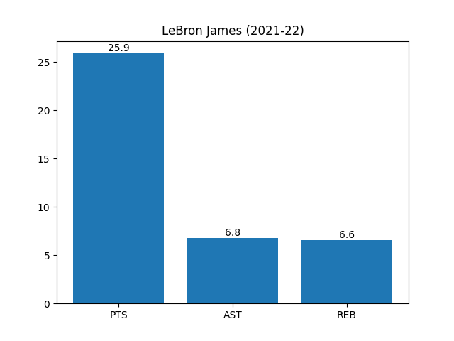
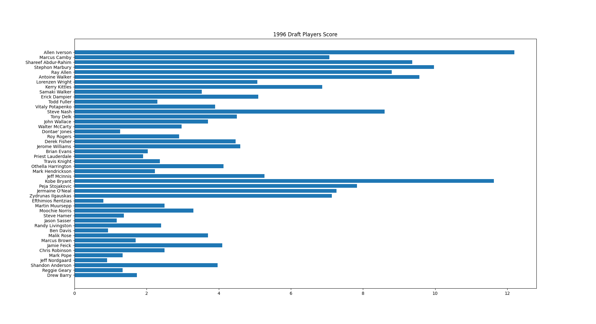

# NBA-plot-graph

Displays NBA player stats as a bar graph.

## Sample
A bar graph of information for one player.

 

A bar graph of the averages of points, assists, and rebounds for players drafted in the same year.

## Author

[twitter](https://twitter.com/ryo_manba)

## Licence

All code is released under the [MIT](https://github.com/ryo-manba/NBA-python/blob/main/LICENSE) license
